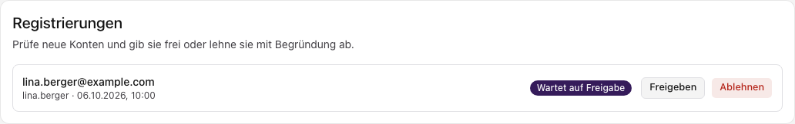
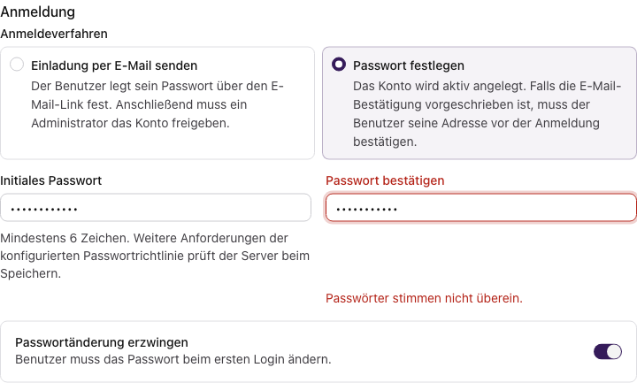

import { Step, Steps } from 'fumadocs-ui/components/steps';
import { Tab, Tabs } from 'fumadocs-ui/components/tabs';

Gilt für: Administration.

## Benutzer einladen und anlegen

Ein neues Benutzerkonto legst du unter **Benutzerverwaltung → Benutzer → Benutzer hinzufügen** an. Im Dialog trägst du die Benutzerdaten ein und wählst, wie die Person ihr Passwort erhält. Rollen und Gruppen weist du nach dem Anlegen zu.

<Callout type="info" title="Voraussetzung">
  Du benötigst die Berechtigung zum Anlegen von Benutzern. Wenn die Schaltfläche fehlt, lass deine Berechtigungen von einem Administrator prüfen.
</Callout>

### 1. Benutzerdaten eintragen

Fülle die Angaben für die Person aus, deren Konto du anlegen möchtest. Die Telefonnummer ist optional; alle anderen Angaben in diesem Abschnitt sind erforderlich.

| Feld | Was du einträgst |
| --- | --- |
| Vorname und Nachname | Den Namen der Person, jeweils höchstens 75 Zeichen. |
| Benutzername | Einen noch nicht vergebenen Anmeldenamen mit mindestens 6 Zeichen, zum Beispiel `lina.berger`. |
| E-Mail | Die E-Mail-Adresse der Person. Sie muss gültig sein und darf noch keinem anderen Konto zugeordnet sein. |
| Telefonnummer (optional) | Falls benötigt, eine noch nicht vergebene Nummer mit 6–30 Zeichen. Ziffern, Leerzeichen, Klammern, Bindestrich, Punkt und ein führendes `+` sind möglich. Sonst lässt du das Feld leer. |

*Beispiel mit fiktiven Benutzerdaten. Unter „Anmeldung“ ist die Einladung bereits vorausgewählt. Du vergibst dabei kein Passwort für die Person.*

### 2. Anmeldeverfahren wählen

| Verfahren | Was du erledigst | Was danach passiert |
| --- | --- | --- |
| Einladung per E-Mail senden | Benutzerdaten eintragen und das Konto anlegen. | Die Person setzt ihr Passwort über den Einladungslink. Danach muss ein Administrator das Konto freigeben. |
| Passwort festlegen | Passwort und Bestätigung eintragen; bei Bedarf die Passwortänderung erzwingen. | Das Konto wird aktiv angelegt. Eine vorgeschriebene E-Mail-Bestätigung bleibt erforderlich. |

<Tabs items={['Mit Einladung', 'Mit Passwort']}>
  <Tab value="Mit Einladung">
    Die Auswahl **„Einladung per E-Mail senden“** ist voreingestellt. Nach dem Anlegen wird der Versand der Einladungs-E-Mail angestoßen. Die Person öffnet den Link und legt ihr Passwort selbst fest.

    **Das Konto bleibt zunächst inaktiv.** Die Annahme der Einladung allein reicht noch nicht zur Anmeldung: Anschließend gibt ein Administrator das Konto frei. Den Ablauf findest du unter [Einladung abschließen und Konto freigeben](#einladung-abschlie%C3%9Fen-und-konto-freigeben).
  </Tab>
  <Tab value="Mit Passwort">
    Wähle **„Passwort festlegen“**. Trage das Passwort in **beide Felder** ein. Die Angaben müssen übereinstimmen, auch wenn du **„Passwortänderung erzwingen“** einschaltest.

    Mit eingeschalteter Passwortänderung heißt das erste Feld **„Initiales Passwort“**. Die Person muss dieses Passwort bei ihrer ersten Anmeldung ändern. Übermittle ihr das Initialpasswort über euren dafür vorgesehenen Weg.

    Das Passwort muss mindestens 6 Zeichen haben. Je nach konfigurierter Passwortrichtlinie können mehr Zeichen, Ziffern, Groß- und Kleinbuchstaben oder Sonderzeichen erforderlich sein. Der Server prüft diese zusätzlichen Anforderungen beim Speichern und zeigt bei einer Ablehnung den Grund an.

    Das Konto wird aktiv angelegt. Wenn die Anmelderichtlinie eine bestätigte E-Mail-Adresse verlangt, muss die Person ihre Adresse vor der Anmeldung bestätigen.
  </Tab>
</Tabs>

*Auch bei einem Initialpasswort füllst du beide Passwortfelder aus. Die eingegebenen Passwörter werden verdeckt dargestellt.*

<Callout type="warn" title="Wechsel zwischen Einladung und Passwort">
  Wenn du das Anmeldeverfahren wechselst, werden beide Passwortfelder geleert und „Passwortänderung erzwingen“ ausgeschaltet. Benutzerdaten bleiben erhalten. Gib ein Passwort nach dem Wechsel zur Passwortanlage erneut ein.
</Callout>

### 3. Konto anlegen

Prüfe vor dem Speichern insbesondere die E-Mail-Adresse und das gewählte Anmeldeverfahren. Wähle dann **„Benutzer anlegen“**. Während der Anlage kannst du die Angaben nicht verändern.

Bei Erfolg schließt sich der Dialog. Die Meldung **„Benutzer erstellt“** erscheint und die Benutzerliste wird aktualisiert. Bei einer Einladung bedeutet das, dass das Konto angelegt und der E-Mail-Versand angestoßen wurde; die Meldung bestätigt noch keine Zustellung der E-Mail.

<Callout title="Rollen und Gruppen folgen nach der Anlage">
  Jedes neue Konto erhält zunächst die Rolle **Basic**. Öffne anschließend die Benutzerzeile und den Reiter **„Berechtigungen“**, um weitere direkte Rollen zuzuweisen. Über **„Benutzergruppen verwalten“** legst du Gruppenmitgliedschaften fest. Für Gruppenmitglieder gelten die Rollen, die der Gruppe zugewiesen sind.
</Callout>

### Einladung abschließen und Konto freigeben

<Steps>
  <Step>
    #### Die Person nimmt die Einladung an

    Die Person öffnet den Link aus der E-Mail und setzt ihr Passwort. Danach ist die E-Mail-Adresse bestätigt, das Konto wartet aber noch auf die Freigabe.
  </Step>
  <Step>
    #### Ein Administrator prüft die Registrierung

    Unter **Benutzerverwaltung → Benutzer** zeigt der Abschnitt **„Registrierungen“** die offenen Konten. Prüfe das Konto mit dem Status **„Wartet auf Freigabe“** und die vorgesehenen Rollen und Gruppen.
  </Step>
  <Step>
    #### Konto freigeben

    Wähle **„Freigeben“** und bestätige die Entscheidung im folgenden Dialog. Danach kann sich die Person anmelden. Wenn du das Konto ablehnst, ist eine Begründung erforderlich; sie wird der Person per E-Mail mitgeteilt.
  </Step>
</Steps>

*Die Einladung ist bereits angenommen. Mit „Freigeben“ startest du die Entscheidung über dieses Konto.*

### Wenn die Anlage nicht klappt

Deine Angaben bleiben bei einem Fehler im Dialog erhalten. Lies die Meldung am Feld oder im unteren Bereich des Dialogs, korrigiere die Angabe und speichere erneut.

*In diesem Beispiel stimmt die Bestätigung nicht mit dem Initialpasswort überein. Trage dasselbe Passwort in beide Felder ein.*

| Meldung oder Situation | Nächster Schritt |
| --- | --- |
| Benutzername, E-Mail-Adresse oder Telefonnummer ist bereits vergeben | Suche zuerst in der Benutzerliste nach dem vorhandenen Konto. Verwende nur dann einen anderen Wert, wenn du eine andere Person anlegst. |
| Passwortbestätigung fehlt oder stimmt nicht überein | Fülle beide Passwortfelder mit demselben Passwort aus. Das gilt auch für ein Initialpasswort. |
| Passwort erfüllt die Richtlinie nicht | Passe das Passwort entsprechend der Servermeldung an und wiederhole es im Bestätigungsfeld. |
| „Benutzer anlegen“ ist nicht auswählbar | Prüfe, ob alle Pflichtfelder und bei Passwortanlage beide Passwortfelder gültig ausgefüllt sind. |
| Person hat die Einladung angenommen, kann sich aber noch nicht anmelden | Prüfe im Abschnitt „Registrierungen“, ob das Konto noch auf Freigabe wartet. |
| Einladungs-E-Mail ist nicht angekommen | Lass die Person den Spam-Ordner prüfen. Prüfe die gespeicherte E-Mail-Adresse und bei weiterhin fehlender Nachricht den E-Mail-Versand der Installation. Lege nicht erneut dasselbe Konto an. |

Wenn du den Dialog mit geänderten Angaben schließt, fragt er nach, ob du die Änderungen verwerfen möchtest. Wähle **„Weiterbearbeiten“**, um im Dialog zu bleiben, oder **„Änderungen verwerfen“**, um ohne Anlage abzubrechen.

## Benutzer verwalten

- [ ] TODO: suchen, filtern, Daten ändern, deaktivieren und reaktivieren.
- [ ] TODO: Benutzergruppen und deren Wirkung erklären (Mitglieder, Rollen, Bereiche).
- [ ] TODO: Konten bei Austritt sperren: Ablauf und Fristen.

## Rollen

- [ ] TODO: Rollen anlegen, duplizieren und löschen.
- [ ] TODO: Berechtigungen zuweisen und Rollen entziehen.
- [ ] TODO: wirksame Berechtigungen je Benutzer prüfen.

## Zuständigkeiten

- [ ] TODO: Bereiche anlegen und verantwortliche Rollen zuordnen.
- [ ] TODO: Beispiel: Standort mit Geräten und Anträgen.

## Abgrenzung

- [ ] TODO: Anmelderichtlinien und Zwei-Faktor-Pflicht festlegen (→ [Sicherheit und Betrieb](sicherheit-betrieb)).
