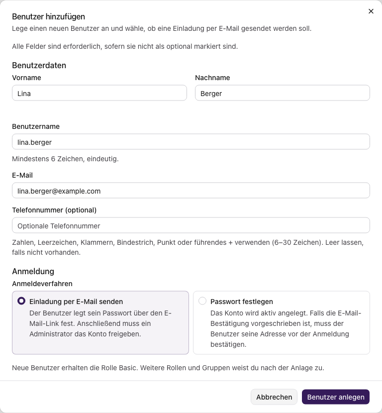
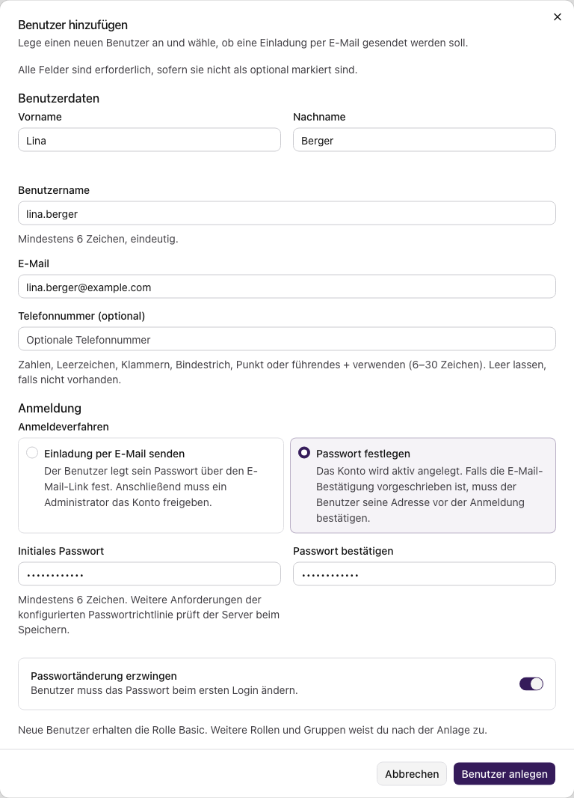
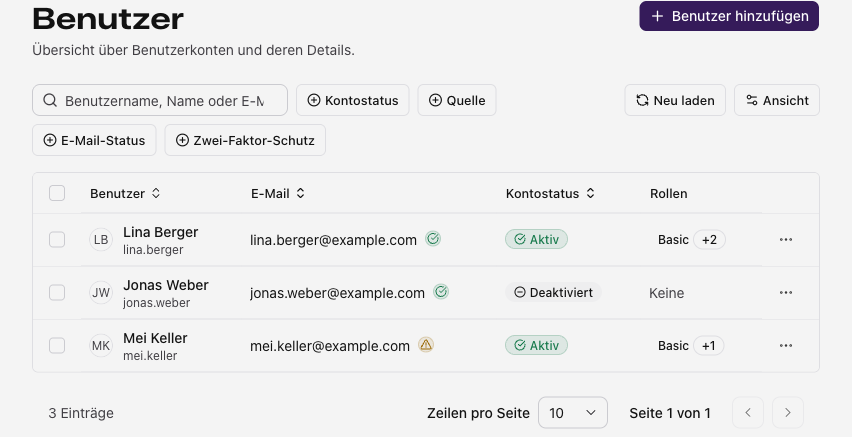
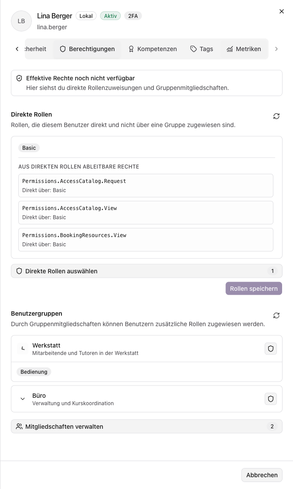

import { Accordion, Accordions } from 'fumadocs-ui/components/accordion';
import { Tab, Tabs } from 'fumadocs-ui/components/tabs';

## Benutzer einladen und anlegen

Öffne **Benutzerverwaltung → Benutzer → Benutzer hinzufügen**. Die Bilder zeigen fiktive Beispielkonten.

1. Trage **Vorname, Nachname, Benutzername und E-Mail** ein. Die Telefonnummer ist optional. Der Benutzername braucht mindestens 6 Zeichen; Benutzername und E-Mail dürfen im System noch nicht vergeben sein.
2. Wähle das Anmeldeverfahren:

<Tabs items={['Mit Einladung', 'Mit Passwort']}>
  <Tab value="Mit Einladung">
    **„Einladung per E-Mail senden“** ist voreingestellt. Die Person legt ihr Passwort selbst fest;
    anschließend musst du das [Konto freigeben](#einladung-abschlie%C3%9Fen-und-konto-freigeben).

    

  </Tab>
  <Tab value="Mit Passwort">
    Wähle **„Passwort festlegen“** und trage dasselbe Passwort in beide Felder ein. Es braucht
    mindestens 6 Zeichen und muss die Passwortrichtlinie erfüllen. Mit **„Passwortänderung
    erzwingen“** muss die Person das Initialpasswort bei der ersten Anmeldung ändern. Übermittle
    es ihr über euren vorgesehenen Weg.

    Das Konto wird aktiv angelegt. Eine E-Mail-Bestätigung kann je nach Anmelderichtlinie erforderlich sein.

    

  </Tab>
</Tabs>

3. Prüfe die Angaben und wähle **„Benutzer anlegen“**.

Neue Konten erhalten die Rolle **Basic**. Weitere Rollen und Gruppen weist du [nach der Anlage zu](#rollen-und-gruppen-zuweisen).

### Einladung abschließen und Konto freigeben

1. Die Person öffnet den Einladungslink und setzt ihr Passwort. Ihre E-Mail-Adresse ist danach bestätigt.
2. Öffne unter **Benutzerverwaltung → Benutzer → Registrierungen** das Konto mit **„Wartet auf Freigabe“**.
3. Prüfe das Konto und wähle **„Freigeben“**. Beim Ablehnen ist eine Begründung erforderlich; sie wird der Person per E-Mail mitgeteilt.

<Accordions>
  <Accordion title="Freigabe ansehen">
    
  </Accordion>
</Accordions>

## Benutzer verwalten

Suche unter **Benutzerverwaltung → Benutzer** nach Name, Benutzername oder E-Mail. Nutze bei Bedarf die Filter. Klicke auf eine Benutzerzeile, um die Details zu öffnen.

Standardmäßig siehst du **Benutzer, E-Mail, Kontostatus und Rollen**. Über **„Ansicht“** kannst du **Gruppen, Quelle, 2FA, Tags, letzte Anmeldung, Erstellungsdatum und ID** zusätzlich einblenden. Die Quelle nennt den Kontoanbieter, 2FA zeigt den Schutzstatus. Klicke auf Rollen oder Gruppen, um alle Zuordnungen zu sehen.

**„Aktiv“** erlaubt die Anmeldung, sofern die Anmelderichtlinie erfüllt ist. **„Deaktiviert“** sperrt neue Anmeldungen. Zugewiesene Tags bestätigen keine Zutrittsberechtigung.

Wenn nicht alle Reiter sichtbar sind, blättere mit den Pfeilen links und rechts. Unter **„Metriken“** siehst du Zugänge und aktive Sitzungen; die Grafik lässt sich als Balken oder Linien anzeigen.

<Accordions>
  <Accordion title="Metriken ansehen">
    
  </Accordion>
</Accordions>

### Benutzerdaten ändern

1. Klicke auf die Benutzerzeile. Die Details öffnen sich im Reiter **„Eigenschaften“**. Ändere die benötigten Angaben oder das Profilbild.
2. Wähle **„Speichern“**. Beim Schließen mit ungespeicherten Änderungen kannst du weiterbearbeiten oder sie verwerfen.

Optionale Angaben entfernst du durch Leeren des Feldes. Für Auswahlfelder und das Geburtsdatum steht **„Leeren“** zur Verfügung. Speichere anschließend die Änderung.

Der Benutzername wird nur angezeigt. E-Mail-Änderungen nimmt die Person nach Bestätigung im eigenen Profil vor, sofern das Konto dies unterstützt. Als vom **LDAP- oder OIDC-Anbieter verwaltet** gekennzeichnete Angaben sind in Mardu schreibgeschützt; Änderungen erfolgen beim Anbieter.

<Accordions>
  <Accordion title="Eigenschaften ansehen">
    
  </Accordion>
</Accordions>

### Rollen und Gruppen zuweisen

Öffne **„Berechtigungen“**. Direkte Rollen gelten für das einzelne Konto. Gruppenrollen gelten für die Mitglieder der Gruppe.

**Direkte Rollen ändern:**

1. Öffne die Rollenauswahl und wähle Rollen an oder ab.
2. Bestätige mit **„Anwenden“**, dann mit **„Rollen speichern“**.

**Gruppenmitgliedschaften ändern:**

1. Wähle **„Mitgliedschaften verwalten“** und ändere die Gruppenauswahl.
2. Bestätige die Auswahl mit **„Anwenden“**, dann mit **„Speichern“** im Dialog für die Gruppenmitgliedschaften.

**„Anwenden“ allein speichert keine Zuweisung.** Eine entfernte Rolle kann über eine andere Gruppe oder eine direkte Zuweisung weiterhin gelten. Die Admin-Rolle lässt sich nur entfernen, wenn mindestens zwei andere Administratoren verbleiben.

### Konten deaktivieren und reaktivieren

1. Öffne **„Sicherheit“ → „Gefahrenbereich“**.
2. Wähle **„Benutzer deaktivieren“** und bestätige. Zum Reaktivieren wählst du **„Benutzer aktivieren“**.

Neue Anmeldungen werden gesperrt; bestehende Zugriffe enden nicht sofort. Rollen, Gruppen und Zutrittszuweisungen bleiben erhalten. Prüfe sie vor einer Reaktivierung. **Administrator-Konten können nicht deaktiviert werden.** Für offene Registrierungen gilt der [Freigabeablauf](#einladung-abschlie%C3%9Fen-und-konto-freigeben).

<Accordions>
  <Accordion title="Deaktivierung ansehen">
    

      
    

  </Accordion>
</Accordions>

### Benutzer löschen

Öffne **„Sicherheit“ → „Gefahrenbereich“ → „Benutzer löschen“**. Prüfe das Konto und die Löschfolgen und bestätige mit **„Löschen“**. Für mehrere Konten nutzt du die Kontrollkästchen in der Liste und die gemeinsame Löschaktion.

**Administrator-Konten und das eigene Konto können nicht gelöscht werden.** Soll das Konto erhalten bleiben, [deaktiviere es](#konten-deaktivieren-und-reaktivieren).

<Accordions>
  <Accordion title="Löschbestätigung ansehen">
    

      
    

  </Accordion>
</Accordions>

Bestätigte Sicherheitsaktionen werden sofort ausgeführt. Das Verwerfen ungespeicherter Profiländerungen macht sie nicht rückgängig.

## Wenn etwas nicht klappt

| Problem                          | Nächster Schritt                                                                                            |
| -------------------------------- | ----------------------------------------------------------------------------------------------------------- |
| Eine Aktion fehlt                | Lass deine Berechtigungen für diese Aktion prüfen.                                                          |
| Eine Angabe ist bereits vergeben | Suche nach dem vorhandenen Konto.                                                                           |
| Die Einladung fehlt              | Prüfe Spam-Ordner, gespeicherte Adresse und E-Mail-Versand. Eine Erfolgsmeldung bestätigt keine Zustellung. |
| Die Anmeldung klappt nicht       | Prüfe Kontostatus, E-Mail-Bestätigung, 2FA und eine noch offene Freigabe.                                   |

Bei Eingabefehlern bleiben die Angaben erhalten. Korrigiere die markierten Felder entsprechend der Meldung und speichere erneut.

<Accordions>
  <Accordion title="Fehlerbeispiel ansehen">
    
  </Accordion>
</Accordions>
