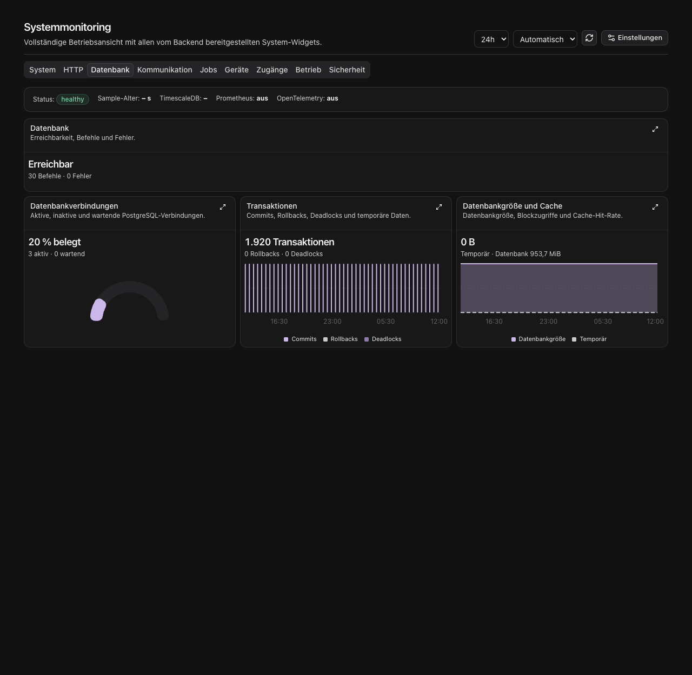
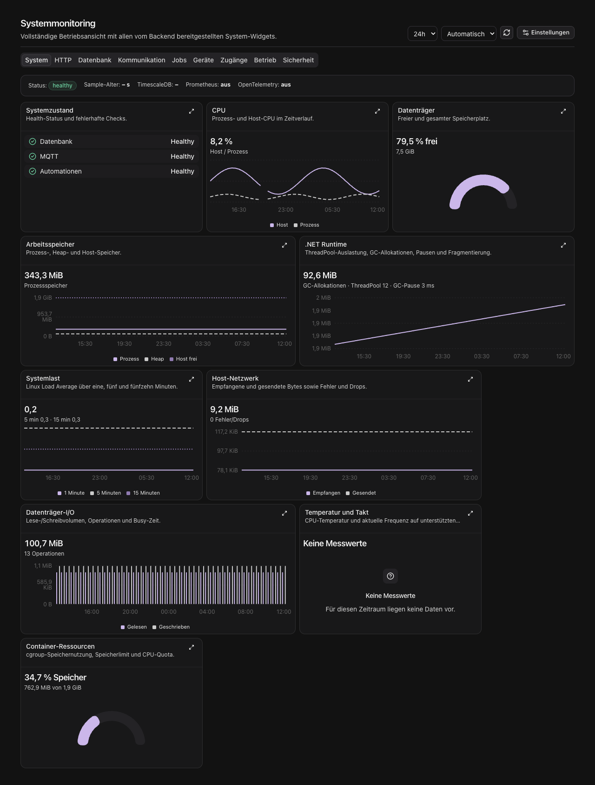

Die **Übersicht** zeigt dein ausgewähltes Dashboard. Unter **Betrieb → Systemstatus** findest du die freigegebenen Systemmetriken nach Bereichen. In den Gerätedetails zeigt **Metriken** Messwerte für dieses Gerät.

## Zeitraum und Diagramme

Wähle den Zeitraum und die Auflösung oberhalb der Karten. Linien zeigen den Verlauf, Balken Messwerte je Intervall und Ringdiagramme die Verteilung, beispielsweise gewährt gegenüber abgelehnt. Die Beschriftung nennt die Einheit. Bei Dauerwerten zeigt ein Durchschnitt die mittlere Dauer; ein Maximum den höchsten gemessenen Wert. Perzentile wie p95 beschreiben das jeweilige Messintervall und sind keine Summe über den Zeitraum.

Die Hauptzahl kann einen Zeitraum zusammenfassen. Angaben wie aktuell aktive Sitzungen oder belegte Verbindungen beschreiben dagegen den zuletzt erfassten Zustand. Bei einem Wechsel von Zeitraum, Bereich oder Gerät werden die passenden Daten neu geladen.

## Fehlende und begrenzte Messwerte

**Keine Messwerte** bedeutet, dass keine passende Messung verfügbar ist. Eine Null bedeutet einen gemessenen Wert von null. Lücken im Diagramm werden nicht als Null aufgefüllt. Manche Hostwerte, etwa Temperatur oder Containergrenzen, sind auf dem jeweiligen System nicht verfügbar.

Ein Hinweis oberhalb der Karten nennt begrenzte Historien. Bei einem Antwortlimit werden die neuesten zusammenhängenden Messpunkte angezeigt; Summen beziehen sich auf diese Punkte. Für mehr Übersicht kannst du einen kürzeren Zeitraum oder eine gröbere Auflösung wählen. Auch Aufbewahrungsgrenzen und Felder, die in der gewählten Auflösung fehlen, werden angezeigt.

Ein Fehlerhinweis bedeutet, dass die Quelle oder Abfrage fehlgeschlagen ist. Lade erneut. Eine unveränderte ältere Anzeige ist keine neue Messung.

## Persönliches Dashboard

Über **Bearbeiten** fügst du Karten hinzu, änderst ihre Darstellung und ordnest sie an. Die verfügbaren Karten richten sich nach deinen Berechtigungen. Speichere die Änderungen, damit die Anordnung beim nächsten Öffnen erhalten bleibt.

Neue Karten erhalten eine zur Darstellung passende Standardgröße. Breitere Diagramme haben mehr Platz als einzelne Kennzahlen; auf schmalen Bildschirmen stehen die Karten untereinander. Bereits gespeicherte eigene Größen bleiben erhalten. Über das Vergrößern-Symbol einer Karte öffnest du die Detailansicht.

## Zutrittsmetriken

Die Metriken in Benutzer-, Geräte- und Zutrittspunktdetails zeigen gewährte und abgelehnte Entscheidungen für sieben UTC-Kalendertage einschließlich heute. Die Erfolgsquote verwendet alle Entscheidungen dieses Zeitraums; ohne Entscheidungen erscheint **–**. **Aktuell aktive Sitzungen** gilt unabhängig von diesem Zeitraum. Darunter stehen die fünf neuesten Entscheidungen.

## Benachrichtigungen

Über die Glocke öffnest du Eingang, ungelesene Mitteilungen und Archiv. Die Benachrichtigungseinstellungen findest du im eigenen Profil.
