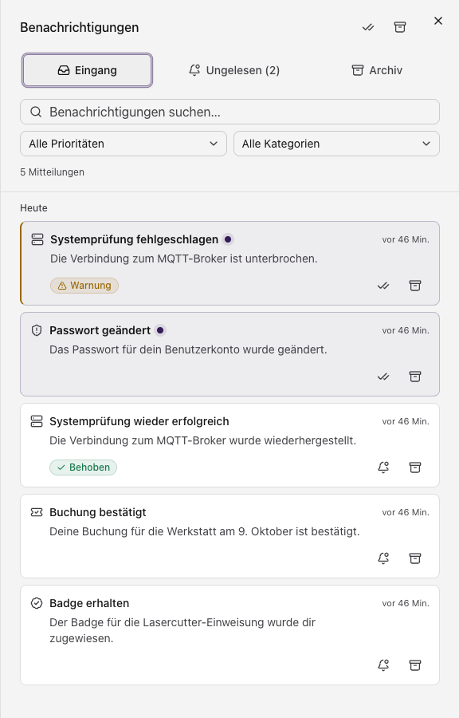

Gilt für: Bediener, Administration.

## Kontodaten

- [ ] TODO: Name, E-Mail und Anzeigebild ändern; E-Mail-Wechsel und Bestätigung.
- [ ] TODO: fehlende Angaben nach Aufforderung vervollständigen (Onboarding-Hinweis).

## Anmeldesicherheit

- [ ] TODO: Passwort ändern und Anforderungen nennen.
- [ ] TODO: Zwei-Faktor einrichten, App wechseln, Wiederherstellungscodes sichern.
- [ ] TODO: erzwungene Wiederherstellungscodes: Ablauf beim ersten Anmelden.
- [ ] TODO: Passkeys registrieren und verwalten.

## Sitzungen

- [ ] TODO: aktive Sitzungen einsehen und einzelne abmelden.
- [ ] TODO: erklären, wann eine Abmeldung auf allen Geräten sinnvoll ist.
- [ ] TODO: unbekannte Sitzung deuten und melden.

## Benachrichtigungen

Öffne die Glocke im Dashboard. **„Eingang“** zeigt nicht archivierte Mitteilungen, **„Ungelesen“** nur ungelesene und **„Archiv“** die archivierten Einträge. Mit Suche, Priorität und Kategorie grenzt du die Liste ein.

Klicke auf einen Eintrag, um den vollständigen Text und weitere Details zu sehen. Die Symbole rechts markieren ihn als gelesen oder ungelesen und archivieren ihn. Im Archiv kannst du ihn in den Eingang zurückholen. Oben markierst du alle Mitteilungen als gelesen oder archivierst die gelesenen. Nach dem Archivieren lässt sich die Aktion über **„Rückgängig“** zurücknehmen.

- [ ] TODO: Kanäle (App, E-Mail, Push) und Ereignisse je Bereich beschreiben.
- [ ] TODO: Ruhezeiten und Zusammenfassungen erklären.
- [ ] TODO: Push-Geräte verwalten (anmelden, entfernen).

## Externe Konten

- [ ] TODO: Badge-Account verknüpfen und Verknüpfung lösen.

## Erscheinungsbild

- [ ] TODO: Farbschema und Anzeigeeinstellungen beschreiben.
- [ ] TODO: Zeitzone, Datums- und Zahlenformate einstellen.

## Bedienhilfen

- [ ] TODO: Schriftgröße, Kontrast und reduzierte Bewegung beschreiben.
- [ ] TODO: Tastaturbedienung der wichtigsten Bereiche nennen.
